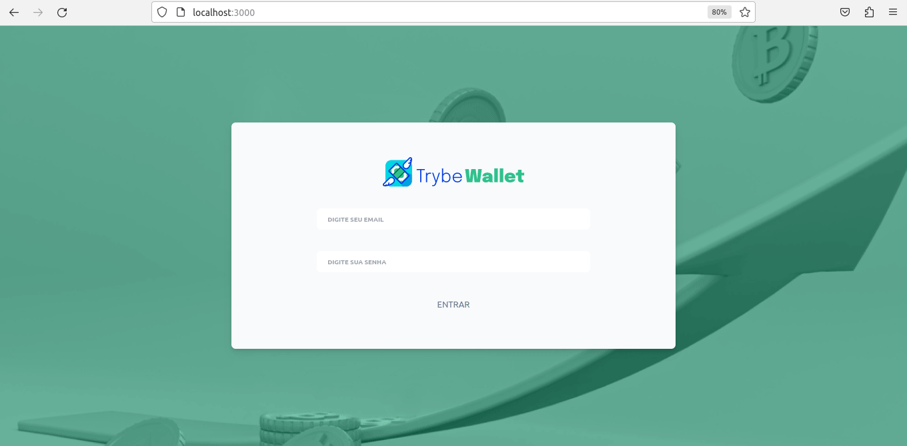

# Boas-vindas ao repositório do projeto de Trybe Wallet! 🚀



[Deploy](https://georgia-rocha.github.io/Trybe-Wallet)

<summary><strong>O que foi desenvolvido</strong></summary><br />
  Foi desenvolvido uma aplicação de uma carteira de controle de gastos com conversor de moedas, sua estilização e seus testes,
  ao utilizar a aplicação o usuário é capaz de:

- Adicionar, remover e editar um gasto;
- Visualizar uma tabelas com seus gastos;
- Visualizar o total de gastos convertidos para uma moeda de escolha;
  
O projeto foi todo desenvolvido usando o Tailwind e a estilização foi de acordo com o proposto pela Trybe através do Figma;

  

# Tecnologias utilizadas <a name="tecnologias"></a>
- [**React**](https://legacy.reactjs.org/docs/getting-started.html)
- [**Redux**](https://redux.js.org/)
- [**React-Router-Dom**](https://reactrouter.com/en/main)
- [**Tailwind**](https://v2.tailwindcss.com/docs)
- [**Jest**](https://jestjs.io/docs/getting-started)
- [**Linter**](https://eslint.org/docs/latest/)
- [**Figma**](https://www.figma.com/best-practices/guide-to-developer-handoff/components-styles-and-documentation/)

<details>
  <summary><strong>Para Clonar e testar a aplicação</strong></summary>
  
### Será necessário ter instalado na sua máquina:
     
  Node v16 +

<summary><strong>Para clonar e testar</strong></summary><br />

1. Clone o repositório  
  ```
  git clone git@github.com:georgia-rocha/Trybe-Wallet.git`
  ```

2. Entre na pasta que você acabou de clonar
  ```
  cd Trybe-Wallet
  ```
3.  Instale as dependências:
  ```
  npm install
  ```
4. Iniciar a aplicação na sua máquina:
  ```
  npm start
  ```
 5. Para rodar os testes
  ```
  npm test
  ```
</details>

<summary><strong>Pontos importantes</strong></summary><br/>

* Esse Projeto foi desenvolvido na sétima sessão de Front-End, onde coloquei em prática o assunto de Gerenciamento de 
  estado utilizando Redux, RTL, Metodologias Ágeis, React Router, Ciclo de vida dos componentes, HOFs.
* A partir deste projeto pude perceber a importância de fazer a estrutura das pages e componests já pensando na estilização,
pois termina se tornando muito mais prático e rápido de se estilizar;

# Requisitos Obrigatórios 100%

- [x] 1. Criei uma página inicial de login;
- [x] 2. Criei um header para a página de carteira;
- [x] 3. Desenvolvi um formulário para adicionar uma despesa;
- [x] 4. Salvei todas as informações do formulário no estado global;
- [x] 5. Desenvolvi testes para atingir 60% de cobertura total da aplicação;
- [x] 6. Desenvolvi uma tabela com os gastos;
- [x] 7. Implemente a lógica para que a tabela fosse alimentada pelo estado da aplicação;
- [x] 8. Criei um botão para deletar uma despesa da tabela;
- [x] 9. Criei um botão para editar uma despesa;
- [x] 10. Desenvolvi testes para atingir 80% de cobertura total da aplicação;
